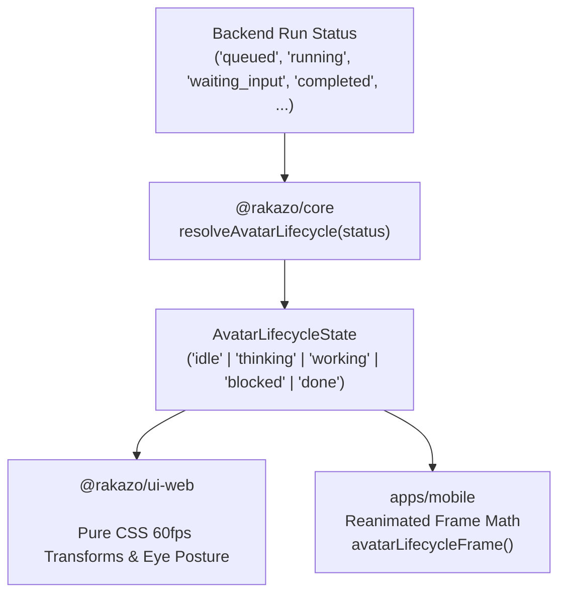

# Bot Avatar Lifecycle Motion Implementation Plan

> **For agentic workers:** REQUIRED SUB-SKILL: Use superpowers:subagent-driven-development (recommended) or superpowers:executing-plans to implement this plan task-by-task. Steps use checkbox (`- [ ]`) syntax for tracking.

**Goal:** Express bot lifecycle states (`idle`, `thinking`, `working`, `blocked`, `done`) quietly and elegantly through the avatar across Web, Electron, and Mobile using the fastest, simplest, and zero-breaking approach.

**Architecture:** Extend `@rakazo/core` with a lightweight, pure `resolveAvatarLifecycle(status)` resolver and pose calculator that maps existing backend run statuses (`idle`, `queued`, `leased`, `running`, `waiting_input`, `waiting_takeover`, `completed`, `failed`) into five core lifecycle states. On Web/Electron, drive subtle 60fps CSS transitions and eye postures via declarative `data-lifecycle` attributes while maintaining backward compatibility with `data-working`. On Mobile (Expo), drive React Native Reanimated through the shared frame math.

**Tech Stack:** TypeScript, React, React Native Reanimated, SVG, CSS Keyframes & Transforms, Vitest.

---

## User Review Required

> [!NOTE]
> **Zero Backend/Database Changes Required**: Rakazo's backend and API already track and return detailed run statuses (`queued`, `leased`, `running`, `waiting_input`, `waiting_takeover`, `completed`, `failed`, `idle`). Previously, the frontend collapsed all of these into a simple boolean `isWorking = true / false`. This plan leverages the existing data stream directly.

> [!IMPORTANT]
> **Minimalist & Quiet Expression (Adhering to AGENTS.md)**:
> In accordance with Rakazo's UX principles ("Treat every visible word as UI", "Start UX work by asking what can be removed", "The app is monochrome: primary is ink, bots carry the only identity color"):
> - **`idle`**: Calm ambient breathing.
> - **`thinking`**: Eyes glance subtly upward and inward (`translate(2px, -3px)`), body floating with a gentle soft-pulse aura (2.4s cycle).
> - **`working`**: Focused rhythmic motion and spinning accent ring.
> - **`blocked`** (waiting for user input / takeover / error): Head tilts slightly (4°), eyes widen subtly, slow heartbeat amber/warm aura (drawing quiet attention without loud flashing).
> - **`done`**: Brief 1.2s celebration settle/dip, smoothly transitioning back to `idle`.

---

## Proposed Changes



---

### Component 1: Core State Machine & Motion Math (`@rakazo/core`)

#### [MODIFY] [`packages/core/src/avatar-motion.ts`](packages/core/src/avatar-motion.ts)
- Add `AvatarLifecycleState` type: `"idle" | "thinking" | "working" | "blocked" | "done"`.
- Implement `resolveAvatarLifecycle(status?: string | null): AvatarLifecycleState`.
- Implement `avatarLifecycleFrame(seed: number, state: AvatarLifecycleState, progress: number): WorkingAvatarFrame`.
- Retain `workingAvatarFrame` as `avatarLifecycleFrame(seed, "working", progress)` for 100% backward compatibility.

```ts
export type AvatarLifecycleState = "idle" | "thinking" | "working" | "blocked" | "done";

export function resolveAvatarLifecycle(status?: string | null): AvatarLifecycleState {
  if (!status || status === "idle" || status === "cancelled") return "idle";
  if (status === "queued" || status === "leased") return "thinking";
  if (status === "running") return "working";
  if (status === "waiting_input" || status === "waiting_takeover" || status === "failed") return "blocked";
  if (status === "completed") return "done";
  return "idle";
}
```

#### [MODIFY] [`packages/core/src/avatar-motion.test.ts`](packages/core/src/avatar-motion.test.ts)
- Add comprehensive test cases verifying resolution for all `RunStatus` values and frame stability for each lifecycle state.

---

### Component 2: Web & Electron UI Presentation (`@rakazo/ui-web`)

#### [MODIFY] [`packages/ui-web/src/bot-avatar.tsx`](packages/ui-web/src/bot-avatar.tsx)
- Import `resolveAvatarLifecycle` and `AvatarLifecycleState` from `@rakazo/core`.
- Add optional `lifecycle?: AvatarLifecycleState` to `BotAvatarProps`.
- Resolve effective lifecycle: `const lifecycle = lifecycleProp ?? resolveAvatarLifecycle(status)`.
- Pass `data-lifecycle={lifecycle}` and keep `data-working={isWorking}` on container and SVG elements.
- Wrap eye elements with `.rakazo-bot-avatar-eyes` with CSS classes reflecting the lifecycle state.
- Update `OrganicAvatar` to support `data-lifecycle={lifecycle}`.

#### [MODIFY] [`packages/ui-web/src/styles.css`](packages/ui-web/src/styles.css)
- Add quiet, elegant CSS rules for:
  - `[data-lifecycle="thinking"]`:
    - Ring breathes slowly (opacity `0.35` -> `0.85`, ease-in-out 2.4s).
    - Eyes glance up-right: `transform: translate(2.5px, -3px)`.
  - `[data-lifecycle="working"]`:
    - Maintains existing spin ring and active pulse.
  - `[data-lifecycle="blocked"]`:
    - Head curious tilt: `transform: rotate(4deg)`.
    - Eyes widen: `transform: scale(1.1)`.
    - Ring carries a calm amber/warning pulse indicating attention needed.
  - `[data-lifecycle="done"]`:
    - Settled bounce animation (1.2s), then rests.
  - `@media (prefers-reduced-motion: reduce)`: All animations gracefully become static rest poses.

#### [MODIFY] [`packages/ui-web/src/bot-avatar.test.tsx`](packages/ui-web/src/bot-avatar.test.tsx)
- Add test assertions for `data-lifecycle="thinking"`, `data-lifecycle="working"`, `data-lifecycle="blocked"`, `data-lifecycle="done"`, and `data-lifecycle="idle"`.
- Ensure all 24 existing tests continue to pass.

---

### Component 3: Mobile (Expo React Native) Integration (`apps/mobile`)

#### [MODIFY] [`apps/mobile/lib/avatar-motion.ts`](apps/mobile/lib/avatar-motion.ts)
- Re-export `AvatarLifecycleState`, `resolveAvatarLifecycle`, and `avatarLifecycleFrame` from `@rakazo/core`.

#### [MODIFY] [`apps/mobile/components/bot-avatar.tsx`](apps/mobile/components/bot-avatar.tsx)
- Compute `const lifecycle = resolveAvatarLifecycle(status)`.
- Adjust Reanimated transitions according to `lifecycle` (different durations and pose offsets for `thinking`, `working`, `blocked`, and `done`).

#### [MODIFY] [`apps/mobile/lib/avatar-motion.test.ts`](apps/mobile/lib/avatar-motion.test.ts)
- Verify mobile frame interpolation for all lifecycle states.

---

## Verification Plan

### Automated Tests
1. **Core Unit Tests**:
   ```bash
   pnpm --config.engine-strict=false vitest run packages/core/src/avatar-motion.test.ts
   ```

2. **Web Component Tests**:
   ```bash
   pnpm --config.engine-strict=false vitest run packages/ui-web/src/bot-avatar.test.tsx
   ```

3. **Mobile Motion Tests**:
   ```bash
   pnpm --config.engine-strict=false vitest run apps/mobile/lib/avatar-motion.test.ts apps/mobile/lib/bot-avatar.test.ts
   ```

### Manual Verification
1. Open the Web app / Electron, start a run that enters `queued` / `leased` (observe the avatar eyes look up in `thinking` mode).
2. As tool calls execute, observe the avatar enter the focused `working` rhythm.
3. Trigger an action requiring user input or takeover (observe the avatar tilting 4° and subtly pulsing in `blocked` mode).
4. When the turn finishes, observe the smooth transition through `done` back to `idle`.
